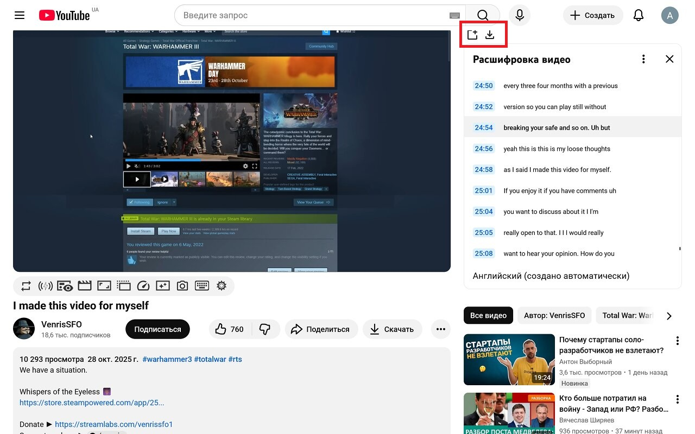

# Save YouTube Transcript as a formated text file

## Chrome extension: Save YouTube Transcript as a formated text file

[chromewebstore](https://chromewebstore.google.com/detail/save-youtube-transcript-a/cmahblfkoacaigpfdefeoapecbccogoo)

## Firefox extension: Save YouTube Transcript as a formated text file

[addons.mozilla.org](https://addons.mozilla.org/ru/firefox/addon/youtube-transcript-to-text/)

## Functionality

- Save YouTube Transcript as a formated text file
- Open the transcript into a new tab to read it more conveniently

You have two extra buttons which may have slightly different positions 
 (depending on video, above or below the transcript).

Use them only after you see the transcript.

## Screenshots

## Licence: MIT