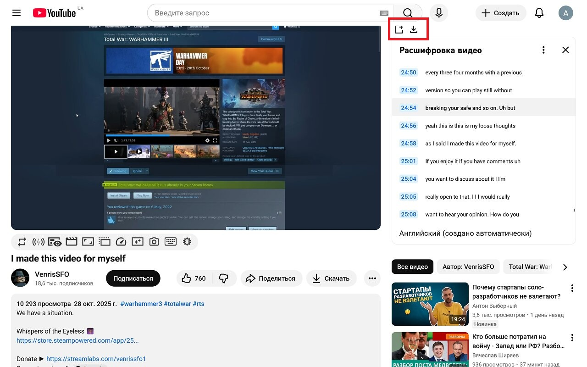
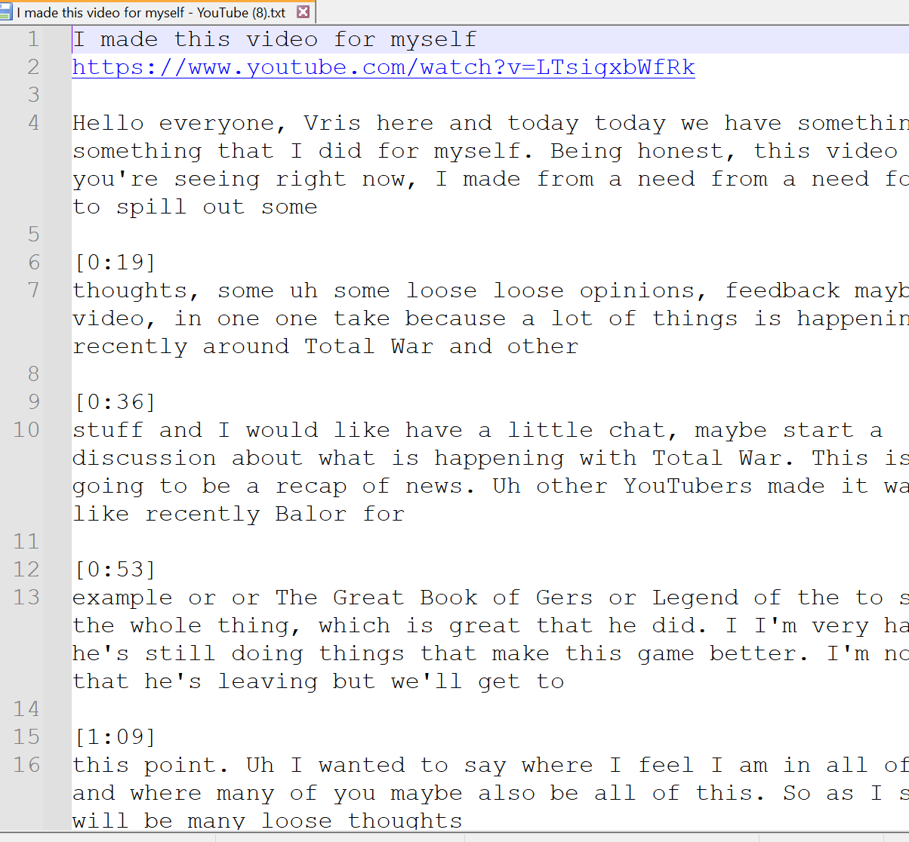
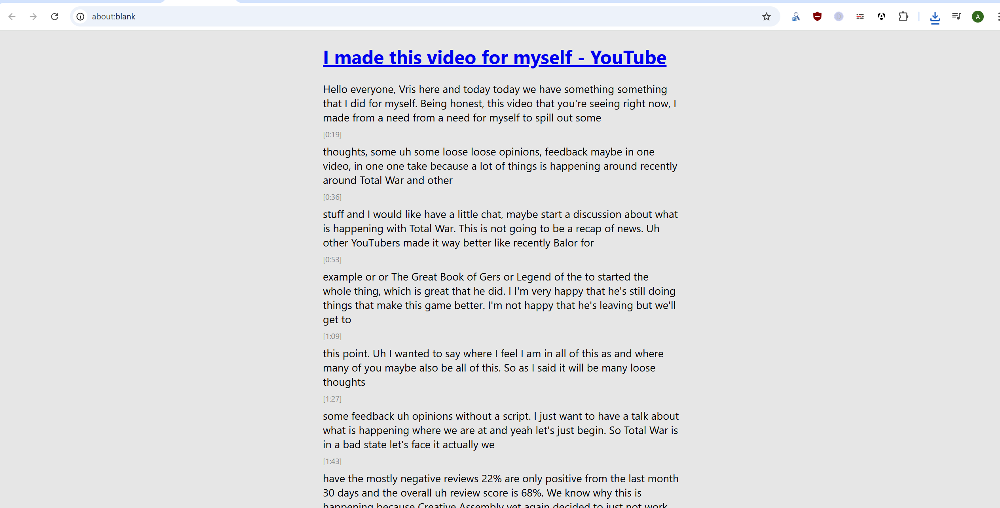

# Save YouTube Transcript as a formated text file

## Chrome extension: Save YouTube Transcript as a formated text file

[chromewebstore](https://chromewebstore.google.com/detail/save-youtube-transcript-a/cmahblfkoacaigpfdefeoapecbccogoo)

## Firefox extension: Save YouTube Transcript as a formated text file

[addons.mozilla.org](https://addons.mozilla.org/ru/firefox/addon/youtube-transcript-to-text/)

## Functionality

- Save YouTube Transcript as a formated text file (md file, you can use any text editor, or Visual Studio Code)
- Open the transcript into a new tab to read it more conveniently

You have two extra buttons which may have different positions 
 (depending on video, above or below the transcript).

Use them only after you see the transcript.

## Limitations

- Two extra buttons have different positions for videos with chapters (below the transcription) and without (above).
- If you go from one page to another two buttons may disappear. Reload the page in this case. 
- You must click on "show video text" to see translation before click on this button.

## Screenshots

## Licence: MIT