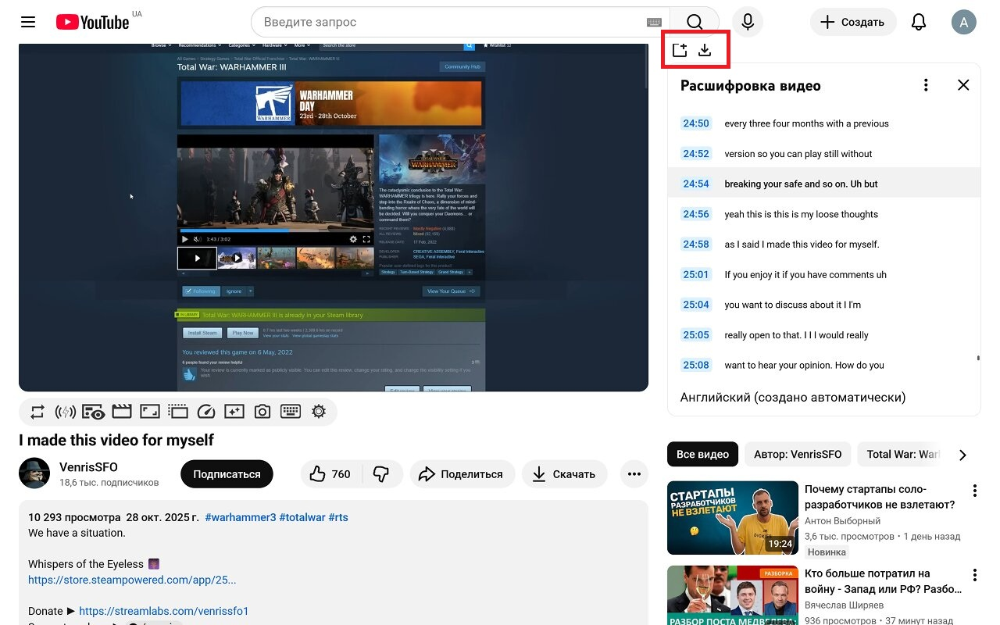
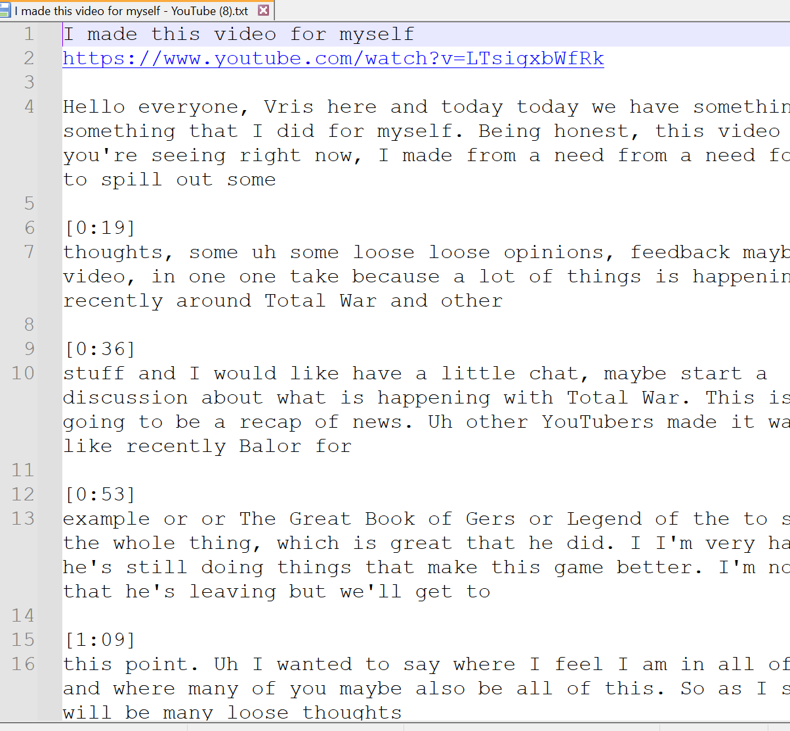
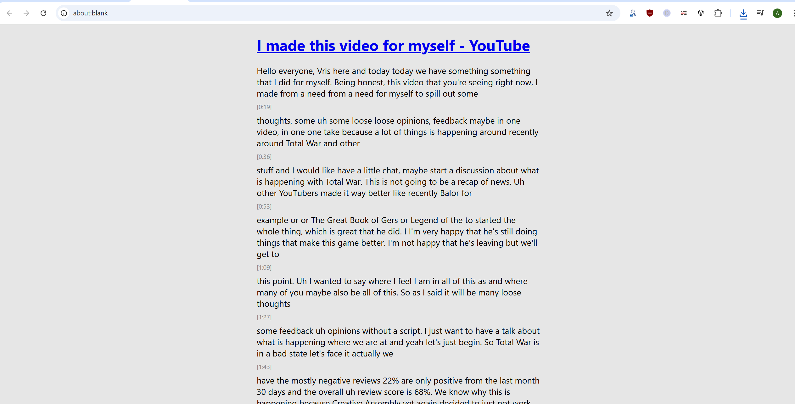

# Save YouTube Transcript as a formated text file

https://youtu.be/3clVUVhE4jA

This is a YouTube extension that was originally created for exporting subtitles to a text file,
but over time its functionality has changed somewhat.
Now it's an extension with several features that I sometimes use.

## Chrome extension: Save YouTube Transcript as a formated text file

[chromewebstore](https://chromewebstore.google.com/detail/save-youtube-transcript-a/cmahblfkoacaigpfdefeoapecbccogoo)

## Firefox extension: Save YouTube Transcript as a formated text file

[addons.mozilla.org](https://addons.mozilla.org/ru/firefox/addon/youtube-transcript-to-text/)

## Functionality

- Add the load transcription button (you have to load transcript before work with it)
- Open the transcript into a new tab to read it more conveniently
- Save YouTube Transcript as a formated text file (md file, you can use any text editor, or Visual Studio Code)
- Add a button to double YouTube speed
- Add a button to copy the cleared url to clipboard (without the time and playlist)

## Limitations

- Then you push the button to double YouTube speed it runs the autoreset function to prevent changing speed from other events. 
 To turn it off, you need to reload the page. Or set another speed.
- If the page has more than one video player (picture in picture), then only the first one will be affected with changing speed.

## Screenshots

## Licence: MIT
